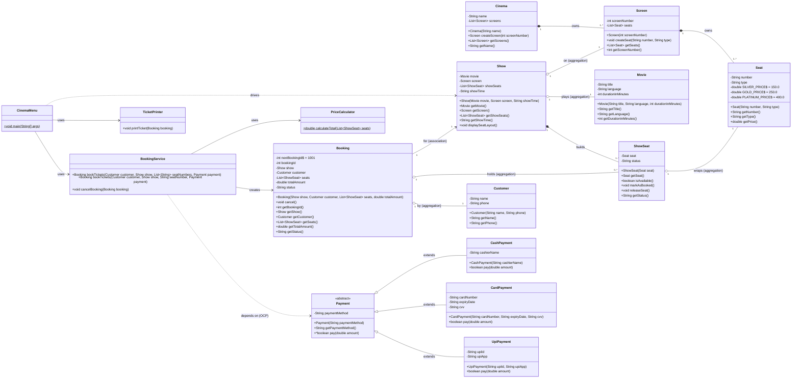
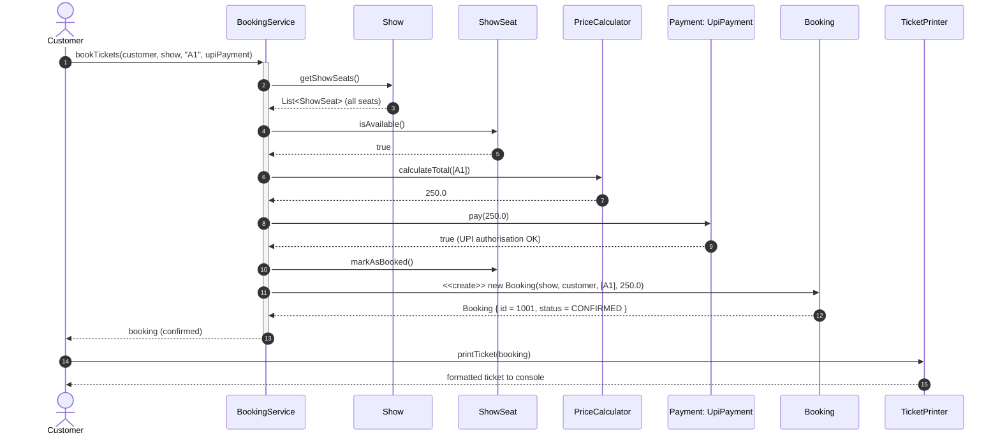

# TCS-504 Assignment 1 — Movie Ticket Booking System

**Deliverables:** Requirement analysis, noun–verb analysis, class responsibilities, relationship justification, Mermaid Class & Sequence diagrams, modular Java code (in `src/`), SOLID mapping, and a captured demo transcript.

All Java sources live in [`src/`](./src) — one class per file, 16 files, compilable with plain JDK (no external libraries).

```bash
cd src
javac --release 17 *.java
java CinemaMenu
```

---

## Step A — Requirement Analysis

### Functional Requirements

| ID  | Requirement |
|-----|-------------|
| FR1 | The system shall list all available movies showing title, language, duration, screen number, and show time. |
| FR2 | The system shall display the seat layout of a selected show, showing each seat's number, type, and status (`AVAILABLE` / `BOOKED`), with SILVER ₹150, GOLD ₹250, PLATINUM ₹400. |
| FR3 | The system shall let a customer book one or more seats for a chosen show using one of three payment methods (UPI, Card, Cash). |
| FR4 | The system shall reject a booking that contains any already-`BOOKED` seat and must not change any state when rejecting. |
| FR5 | The system shall calculate the total as the sum of seat prices and shall mark seats as `BOOKED` **only after** the payment succeeds. |
| FR6 | The system shall support replacing/extending payment methods through the `Payment` abstraction; `CardPayment.pay()` is deliberately simulated to always fail to prove the failed-payment path. |
| FR7 | The system shall cancel a booking: set its status to `CANCELLED` and release every seat back to `AVAILABLE`. |
| FR8 | The system shall never crash on bad input: all numeric menus validate with `Scanner.hasNextInt()` and non-integer input is rejected with a message. |

### Non-Functional Requirements

| ID  | Requirement |
|-----|-------------|
| NFR1 | **Modularity:** every class resides in its own `.java` file and compiles together with a single `javac` command; no cross-file interleaving. |
| NFR2 | **Extensibility:** adding `NetBankingPayment` requires creating exactly one new file; zero edits to `BookingService`, `Booking`, or `Payment`. |
| NFR3 | **Input validation:** all console input is validated; no uncaught `InputMismatchException`/`NumberFormatException` escapes to the user. |
| NFR4 | **Usability:** every prompt is intention-revealing and every ticket/layout output is a formatted, human-readable report. |

---

## Step B — Noun–Verb Analysis

### Nouns

| Noun | Keep as? | Justification |
|------|----------|---------------|
| cinema | ✅ class `Cinema` | Owns screens; root of the venue model. |
| screen | ✅ class `Screen` | Owns seats; holds show. |
| seat | ✅ class `Seat` | Atomic bookable unit; carries price. |
| show | ✅ class `Show` | Binds a movie, screen, and per-show seat states. |
| showSeat | ✅ class `ShowSeat` | Per-show seat status; required to prevent double booking. |
| movie | ✅ class `Movie` | Entity with title/language/duration. |
| customer | ✅ class `Customer` | Entity with name/phone. |
| booking | ✅ class `Booking` | Captures orders; holds status + seats. |
| payment | ✅ abstract class `Payment` | Abstraction over paying; enables OCP. |
| UPI payment | ✅ class `UpiPayment` | `is-a` Payment, succeeds. |
| card payment | ✅ class `CardPayment` | `is-a` Payment, simulated to fail. |
| cash payment | ✅ class `CashPayment` | `is-a` Payment, succeeds. |
| price calculator | ✅ class `PriceCalculator` | Owns the price-math behaviour (SRP). |
| ticket printer | ✅ class `TicketPrinter` | Owns the output-formatting behaviour (SRP). |
| booking service | ✅ class `BookingService` | Owns the booking orchestration behaviour (SRP). |
| menu | ✅ class `CinemaMenu` | Console UI shell; holds `main`. |
| ticket | ❌ not a class | It is the *formatted output* produced by `TicketPrinter`; modelling it as a class adds no behaviour. |
| amount | ❌ not a class | Attribute `double totalAmount` in `Booking`. |
| status | ❌ not a class | Attribute `String status` in `ShowSeat` and `Booking`. |

### Verbs

| Verb | Mapping |
|------|---------|
| book | `BookingService.bookTickets(...)` (2 overloads) |
| pay | `Payment.pay(double)` — abstract, overridden by subclasses |
| cancel | `Booking.cancel()` + `BookingService.cancelBooking(...)` |
| display / print | `Show.displaySeatLayout()`, `TicketPrinter.printTicket(...)` |
| calculate | `PriceCalculator.calculateTotal(...)` |
| select / choose / list / view | `CinemaMenu` menu actions with `readMenuChoice(...)` validation |

---

## Step C — Class Responsibilities (Know / Do / MUST NOT do)

### Core Entities

| Class | Knows | Does | MUST NOT do |
|-------|-------|------|-------------|
| `Movie` | title, language, duration | expose read-only details | change its own or any other state |
| `Seat` | number, type, price constants | answer `getPrice()` by type | change seat/booking/layout state |
| `Screen` | number, its seats | create & hold seats | process payments/print tickets |
| `Cinema` | name, its screens | create & hold screens | book seats or print |
| `Show` | movie, screen, showTime, showSeats | build `ShowSeat`s, display layout | book/pay anything while displaying |
| `ShowSeat` | a `Seat`, status | `isAvailable`, `markAsBooked`, `releaseSeat` | calculate price or print |
| `Customer` | name, phone | expose details | own bookings |
| `Booking` | id, show, customer, seats, total, status | cancel (flip its own status) | process payments |

### Behaviour Classes

| Class | Knows | Does | MUST NOT do |
|-------|-------|------|-------------|
| `Payment` (abstract) | payment method label | define `abstract boolean pay(double)` | reveal implementation details |
| `UpiPayment` | upiId, upiApp | pay → returns `true` | mark seats booked |
| `CardPayment` | card#, expiry, cvv | pay → returns `false` (simulated failure) | mark seats booked |
| `CashPayment` | cashierName | pay → returns `true` | mark seats booked |
| `PriceCalculator` | (stateless) | `calculateTotal(List<ShowSeat>)` | print or mutate seat status |
| `TicketPrinter` | (stateless) | `printTicket(Booking)` formats + prints | calculate prices |
| `BookingService` | (stateless orchestrator) | validate availability → pay → mark booked → create `Booking`; cancel | compute seat base price itself |
| `CinemaMenu` | shows, active bookings, scanner | drive menus, run demo, wire objects | hold business rules |

---

## Step D — Relationships & Justification (lifetime test)

| Pair | Relationship | Lifetime test: whole destroyed → part dies? | Justification |
|------|--------------|---------------------------------------------|---------------|
| Cinema – Screen | **Composition** | Yes | Screens are born only via `cinema.createScreen(...)` and are exclusively owned by that cinema. A screen with no cinema cannot exist in this domain. |
| Screen – Seat | **Composition** | Yes | Seats are born only via `screen.createSeat(...)`. A seat is physically part of a screen; it dies with it. |
| Show – Movie | **Aggregation** | No | The same `Movie` object could be reused by another show. The movie is *passed in* and outlives any single show. |
| Show – Screen | **Aggregation** | No | The `Screen` is owned by the `Cinema` (composition there); the show merely *points at* it and does not own it. |
| Show – ShowSeat | **Composition** | Yes | `ShowSeat`s are constructed *inside* the `Show` from the screen's seats. They encode per-show state and disappear with the show. |
| Booking – Customer | **Association** | Irrelevant (neither owns) | Customer and Booking are independent peers; the booking only *references* who booked. Destroying one leaves the other intact. |
| Booking – ShowSeat | **Aggregation** | No | ShowSeats are owned by the Show. The booking *borrows* references; after cancellation the seats continue living with the show. |
| Booking – Payment | **Association** (transient use) | No | The payment object is passed through `BookingService` at book time and used once; the booking stores only the amount + status, never the payment. |
| Payment – UpiPayment/CardPayment/CashPayment | **Inheritance** | — | `is-a` relationship; each subclass overrides `pay()`. |
| BookingService – Booking | **Association** | No | The service creates and cancels bookings, but ownership stays with caller (`CinemaMenu` keeps the active list). |

---

## Step E — Class Diagram (Mermaid)



> `$` = static member, `*` = abstract method, `--`/`<|--` = composition/aggregation/inheritance.

---

## Step F — Sequence Diagram (customer books 1 seat, pays by UPI)



**Failed-payment branch:** if `pay()` had returned `false`, `BookingService` prints `BOOKING ABORTED` and returns `null` — `markAsBooked()` is never reached, so no `Booking` is created and the seat stays `AVAILABLE`.

---

## Step G — Modular Java Code

The complete, runnable application is generated in [`src/`](./src) — one public class per file, no external libraries.

| # | File | Class type | Key behaviour |
|---|------|-----------|---------------|
| 1 | `Movie.java` | entity | title / language / duration |
| 2 | `Seat.java` | entity | price constants (150/250/400), `getPrice()` |
| 3 | `Screen.java` | entity | owns seats (`createSeat`) |
| 4 | `Cinema.java` | entity | owns screens (`createScreen`) |
| 5 | `ShowSeat.java` | entity | status lifecycle (`isAvailable`/`markAsBooked`/`releaseSeat`) |
| 6 | `Show.java` | entity | builds `ShowSeat`s, `displaySeatLayout()` |
| 7 | `Customer.java` | entity | name / phone |
| 8 | `Booking.java` | entity | static `nextBookingId`, status, `cancel()` |
| 9 | `Payment.java` | abstract behaviour | `abstract boolean pay(double)` |
| 10 | `UpiPayment.java` | behaviour | `pay()` → `true` |
| 11 | `CardPayment.java` | behaviour | `pay()` → `false` (simulated failure) |
| 12 | `CashPayment.java` | behaviour | `pay()` → `true` |
| 13 | `PriceCalculator.java` | behaviour | `calculateTotal(List<ShowSeat>)` |
| 14 | `TicketPrinter.java` | behaviour | `printTicket(Booking)` |
| 15 | `BookingService.java` | behaviour | overloaded `bookTickets(...)`, `cancelBooking(...)` |
| 16 | `CinemaMenu.java` | behaviour | `main`, menu loop, automated edge-case demo |

Every required OOP concept is explicitly marked with a `// OOP Concept: ...` comment in the source (Encapsulation, Abstraction, Inheritance, Runtime Polymorphism, Compile-Time Polymorphism, Static Members, `this`, Composition, Aggregation, Association). Each class opens with `// ================= FILE: <ClassName>.java =================`.

### Edge-case handling (as coded)
- **Double booking** — `BookingService.areAllAvailable(...)` short-circuits before any payment/mutation: `BOOKING REJECTED`.
- **Failed payment** — seats are marked `BOOKED` *only after* `payment.pay(...)` returns `true`; on `false` the method returns `null` and state is untouched.
- **Cancellation** — `cancelBooking(...)` calls `Booking.cancel()` and `releaseSeat()` for every seat.
- **Invalid input** — every numeric prompt goes through `readMenuChoice(...)` which loops on `Scanner.hasNextInt()`.

---

## Step H — SOLID Mapping & "What I didn't do"

**1. Single Responsibility Principle (SRP)**
`PriceCalculator` only sums prices, `TicketPrinter` only formats/prints, `Booking` only holds data + status, `Show.displaySeatLayout()` only reads. Payment and seat-state concerns never bleed into reporting.

**2. Open/Closed Principle (OCP)**
`BookingService.bookTickets(...)` receives a `Payment` **abstraction** and calls `pay()`. Swapping in `NetBankingPayment` tomorrow means creating one new `.java` file — `BookingService`, `Booking`, and `Payment` are untouched.

**3. Liskov Substitution Principle (LSP)**
All three subclasses (`UpiPayment`, `CardPayment`, `CashPayment`) are passed to the same `BookingService` without any type checking or `instanceof`. They differ only in their `pay()` return value; the service treats both outcomes uniformly (`true` → book, `false` → abort).

**4. Dependency Inversion (bonus)**
High-level `BookingService` depends on the `Payment` abstraction, never on concrete payment classes (dependency injection via the menu).

### What I deliberately did NOT do
I did **not** implement a persistence/database layer, authentication, or a real payment gateway. The scope is a single-cinema, in-memory console system, so bookings live only for the lifetime of the `CinemaMenu` process (`ACTIVE_BOOKINGS` list), and payments are simulated — as the assignment's "small system" scope requires.

---

## Step I — Expected Demo Output

This is the **actual captured transcript** of `java CinemaMenu` (run with the scripted session: list movies → book RRR `A1` by UPI → cancel → re-check layout → exit). It proves all four edge cases plus the full happy path.

```text
========== AUTOMATED DEMO: PROVING ALL 4 EDGE CASES ==========

[EDGE CASE 1] Booking A1, A2 on Show 1 via UPI...
Processing UPI payment of Rs.500.00 via GPay (UPI ID: john@upi)
UPI payment successful!
BOOKING CONFIRMED: Booking ID 1001
========================================
              MOVIE TICKET             
========================================
Booking ID  : 1001
Status      : CONFIRMED
Customer    : John Doe
Phone       : 9876543210
----------------------------------------
Movie       : Interstellar
Language    : English
Duration    : 169 mins
Screen      : 1
Show Time   : 2024-01-15 14:00
----------------------------------------
Seats       :
              A1 (GOLD) - Rs.250.00
              A2 (GOLD) - Rs.250.00
----------------------------------------
Total Amount: Rs.500.00
========================================
Thank you for booking! Enjoy the movie!
========================================

[EDGE CASE 1] Attempting DOUBLE BOOKING of already booked A1, A2 via Cash...
BOOKING REJECTED: One or more seats are already booked.
VERIFIED: Double booking REJECTED. Seat A1 is BOOKED and seat A2 is BOOKED.

[EDGE CASE 2] Attempting booking of A3 via Card (payment always fails)...
Processing card payment of Rs.250.00 (Card ending in 3456)
Card payment FAILED! Insufficient funds.
BOOKING ABORTED: Payment failed. Seats were NOT marked as booked.
VERIFIED: Payment FAILED, no Booking created, seat untouched. Seat A3 is still AVAILABLE.

[EDGE CASE 3] Cancelling booking 1001...
BOOKING CANCELLED: Booking ID 1001 cancelled. Seats released and marked as AVAILABLE again.
VERIFIED: Booking status is CANCELLED. Seat A1 is AVAILABLE and seat A2 is AVAILABLE.

[EDGE CASE 4] Feeding invalid non-integer input 'abc' then 'xyz' then valid '2'...
    INVALID INPUT: Please enter a number.
    INVALID INPUT: Please enter a number.
VERIFIED: Invalid input handled gracefully without crashing. Valid choice 2 accepted.

========== DEMO COMPLETE ==========

========== MOVIE TICKET BOOKING SYSTEM - MAIN MENU ==========

    1. List movies
    2. View seat layout of a show
    3. Book tickets
    4. Cancel a booking
    5. Exit
    Enter your choice: 
    Available Movies:
    1. Interstellar (English, 169 mins) on Screen 1 at 2024-01-15 14:00
    2. RRR (Telugu, 186 mins) on Screen 2 at 2024-01-15 18:00

    1. List movies
    2. View seat layout of a show
    3. Book tickets
    4. Cancel a booking
    5. Exit
    Enter your choice: 
    Available shows:
    1. Interstellar (English, 169 mins) on Screen 1 at 2024-01-15 14:00
    2. RRR (Telugu, 186 mins) on Screen 2 at 2024-01-15 18:00
    Choose a show (1 or 2): Seat layout for RRR on Screen 2 at 2024-01-15 18:00
  A1 (PLATINUM): AVAILABLE
  A2 (PLATINUM): AVAILABLE
  A3 (PLATINUM): AVAILABLE
  A4 (PLATINUM): AVAILABLE
  A5 (PLATINUM): AVAILABLE
  B1 (GOLD): AVAILABLE
  B2 (GOLD): AVAILABLE
  B3 (GOLD): AVAILABLE
  B4 (GOLD): AVAILABLE
  B5 (GOLD): AVAILABLE
    Enter seat numbers (comma separated, e.g. A1,B2):     Payment methods: 1. UPI  2. Card (simulated FAILURE)  3. Cash
    Choose payment method: Processing UPI payment of Rs.400.00 via GPay (UPI ID: john@upi)
UPI payment successful!
BOOKING CONFIRMED: Booking ID 1002
========================================
              MOVIE TICKET             
========================================
Booking ID  : 1002
Status      : CONFIRMED
Customer    : John Doe
Phone       : 9876543210
----------------------------------------
Movie       : RRR
Language    : Telugu
Duration    : 186 mins
Screen      : 2
Show Time   : 2024-01-15 18:00
----------------------------------------
Seats       :
              A1 (PLATINUM) - Rs.400.00
----------------------------------------
Total Amount: Rs.400.00
========================================
Thank you for booking! Enjoy the movie!
========================================

    1. List movies
    2. View seat layout of a show
    3. Book tickets
    4. Cancel a booking
    5. Exit
    Enter your choice:     Active bookings:
    1. Booking ID 1002 - RRR - CONFIRMED
    Choose a booking to cancel: BOOKING CANCELLED: Booking ID 1002 cancelled. Seats released and marked as AVAILABLE again.

    1. List movies
    2. View seat layout of a show
    3. Book tickets
    4. Cancel a booking
    5. Exit
    Enter your choice: 
    1. Interstellar (English, 169 mins) on Screen 1 at 2024-01-15 14:00
    2. RRR (Telugu, 186 mins) on Screen 2 at 2024-01-15 18:00
    Choose a show (1 or 2): Seat layout for RRR on Screen 2 at 2024-01-15 18:00
  A1 (PLATINUM): AVAILABLE
  A2 (PLATINUM): AVAILABLE
  A3 (PLATINUM): AVAILABLE
  A4 (PLATINUM): AVAILABLE
  A5 (PLATINUM): AVAILABLE
  B1 (GOLD): AVAILABLE
  B2 (GOLD): AVAILABLE
  B3 (GOLD): AVAILABLE
  B4 (GOLD): AVAILABLE
  B5 (GOLD): AVAILABLE

    1. List movies
    2. View seat layout of a show
    3. Book tickets
    4. Cancel a booking
    5. Exit
    Enter your choice: Thank you for using Movie Ticket Booking System. Goodbye!
```

Observe: after cancellation, the final layout re-check shows `A1 ... : AVAILABLE` again — the cancelling edge case is proven in the interactive flow too.